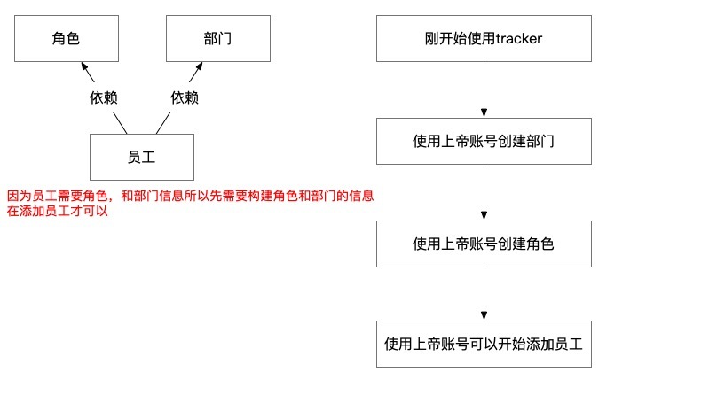
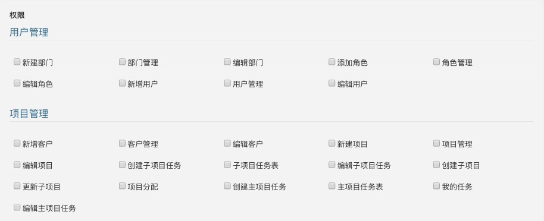
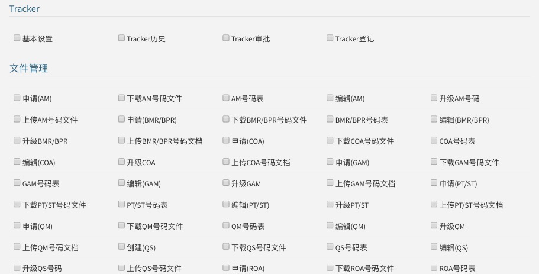
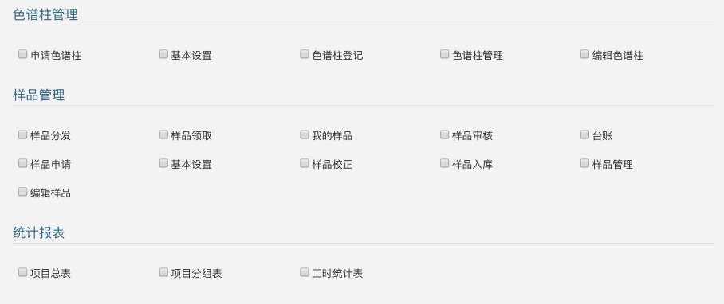
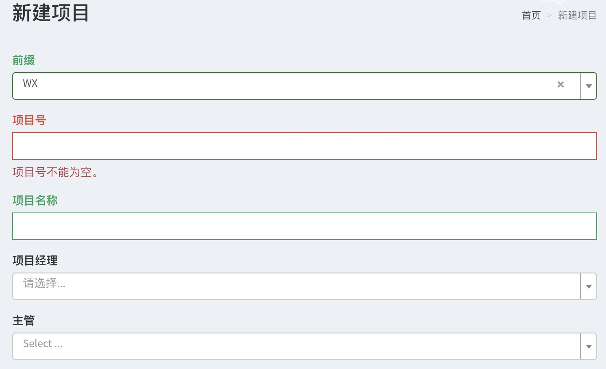
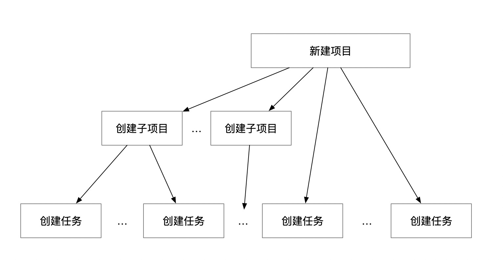
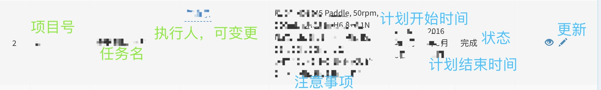
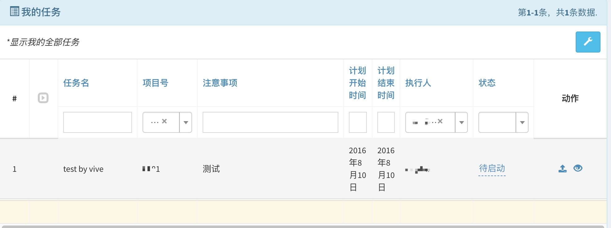
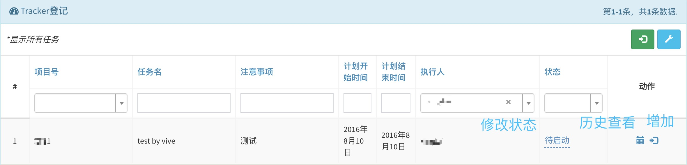

# tracker系统使用快速入门
功能目录简介
- 用户管理
> 用户管理模块用于对本公司的员工进行配置管理，包括员工，部门，权限角色三个模块
######注意：需要先创建部门和角色，在创建员工（因为员工有部门和角色的属性要填写）

1. 用户管理：
  
    - 查看所有公司内部的员工信息列表
    - 通过列表项上方的输入框可以快速进行检索，输入待检索内容后，按下键盘回车键即可以查询
    - 通过列表项上的眼睛按钮可以查看该员工的具体信息
    - 通过眼睛旁边的笔按钮可以修改该员工信息
2. 部门管理：
    
    - 查看公司目前组织结构下的所有部门信息
    - 通过新建部门来创建一个新部门
    - 每个部门都需要指定部门主管，最顶级的部门的主管默认是admin
    - 展示内容和用户管理模块类似
3. 角色分配：
    
    - 可以查看所有已经定义的角色
    - 添加角色
    >通过角色管理所有的功能操作权限
    
    
    
    
    1. 用户管理：是否允许该角色配置拥有配置部门，管理角色，用户管理
    2. 项目管理：客户操作，项目操作，子任务操作，项目分配操作，编辑任务等操作
    3. tracker：基本操作: tracker登记，tracker审批，tracker历史查看以及基本设置
    4. 文件管理：各种文件类型编号申请，创建上传文件，会有历史版本，同一个文件在不同的编号上是唯一的
    5. 色谱柱管理：申请，基本设置，登记以及管理
    6. 样品管理：包括样品入库，审核，领取，审核，台账校正以及基本设置等
- 项目管理
> 为什么要项目管理模块？因为所有的tracker记录都是依托于具体的任务的，所以需要存在任务这个概念。从而衍生出任务管理需求，
而任务没有单独存在的意义，需要宿主在项目里，最终成型为对项目的管理，和项目拆分，最终划分成任务级别（可以分配到员工直接执行）
1. 新建项目
    
    1. 新建项目时，会需要填写几个字段，有一个叫前缀的，这个意思是客户的简称，用来确定这个项目是属于那个客户的
    2. 项目号，公司会用这个项目号来定义和管理公司内部的项目，这个编号约定是用英文来来命名的
    3. 项目名称，就是中文简称或者更具体名称描述
    4. 项目经理，是这个项目的具体负责人
    5. 主管，是项目经理的leader，是一种汇报关系的记录
2. 项目管理
    > 项目管理的核心，就是下面这张图，它是一个三层结构的项目关系管理图，从步骤一中新建的项目，就是这个图最上面的项目，
    为了拆解项目工作，可以把一个项目拆分成N多子项目和M多任务， 另外子项目又可以分拆成X多任务，最终都是划分成任务去分解项目的，
    我们有对每个任务都设置了预计时间，就是为了评估预计时间的成本支出和实际耗时之间的差异，可以估算出任务模块的消耗成本范围
    
    
    - 通过上面的图再去理解项目管理模块的设计就很容易理解了
    - 一个项目，子项目都要有负责人，即项目经理，拆分子项目的就是为了让各位模块的leader来把控
    - 一个任务，需要制定执行人，该执行人就需要对任务变化进行每日tracker记录数据，然后对任务的完成状态进行修改，系统就会统计到整个项目模块的进度以及员工的工作进度
3. 项目分配
    
    - 会把已经拆到任务级别的项全部展示在这里，在这里各位领导可以指定分配给任务执行人
    - 可以筛选各种条件下的任务列表，然后指定给任务执行人
4. 我的任务
    
    - 我任务，是指分配我去具体执行的任务列表，你可以针对这个任务的状态进行设置，比如我已经完成这个任务了，那么我就可以把任务状态调整成已完成
    - 可以针对我的任务增加附件，其他人可以下载附件查看更详细的资料
5. 客户管理    
    - 客户管理，比较简单，主要是为了在创建项目时候，能关联到具体的客户，这里创建了的简称，就是新建项目时候所需要的前缀字段
- tracker
> tracker模块的作用： tracker用户任务执行人每天对任务执行情况的追踪记录
1. tracker登记，任务执行人选择要登记的任务，然后可以对该选择的任务进行登记了
    
    1. 查看登记历史
    2. 增加登记
2. tracker审批，对于任务执行人登记的记录，需要对应的主管确认是否有效，审批就是让前面的登记生效一个的校验手段
3. tracker历史，单独拉出来是为了方便看到所有的tracker记录，便于查看，另外如果有有存在加班等情况也能筛选出来，同时这里还有一个复制功能，就是为了补上漏掉的tracker
4. tracker设置，除了常规的工作tracker，还有一些假期，培训，会议，打扫实验室等软性事务tracker配置
- 统计报表
1. 项目总表，以项目角度把所有的项目整理成execl表格导出
2. 项目分组表，选择一个组长，然后以这个组长为维度输出其下的项目进度
3. 工时统计表，以人为维度，统计出这个人在指定时间内的工作绩效产出
- 文件管理
> 文件管理，主要负责生成编号，上传文件，以及相同编号不同文件版本之间的文件升级管理，类似于把文件升级过程记录成一个历史，可以看到整个文件版本升级的记录
- 色谱柱管理
1. 色谱柱管理：登记，修改等
2. 申请色谱柱
3. 我的色谱柱
4. 基本设置：色谱柱对应的公司信息，品牌信息，键合相种类，这些都是为了登记色谱柱需要的数据
- 样品管理
0. 样品管理：查看所有样品，台账记录，样品量校正，更新一些参数等
1. 样品入库：对样品入库进行记录
2. 样品申请：对样品使用进行申请
3. 样品审核：对样品使用的申请进行审批
4. 样品分发：对样品使用的申请在审批之后，进行分发
5. 我的样品：我名下的样品
6. 基本设置：创建一个样品所需的参数：样品类型，样品剂型，样品包装，存储温控，存储条件以及样品单位等设置