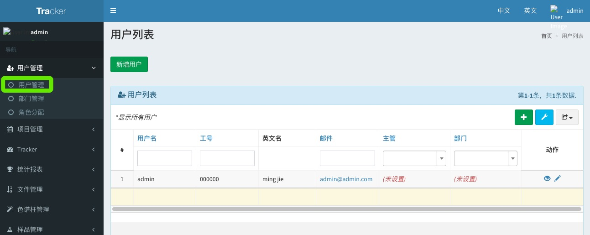
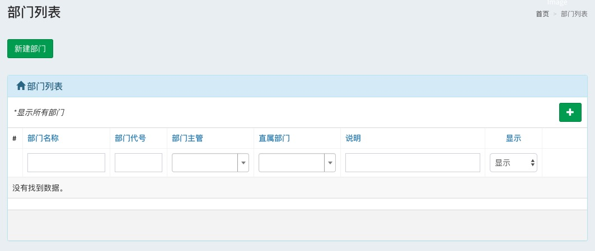
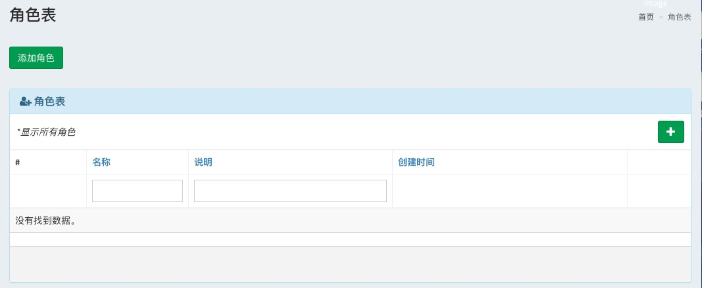

# tracker系统使用快速入门
功能目录简介
- 用户管理
> 用户管理模块用于对本公司的员工进行配置管理，包括员工，部门，权限角色三个模块
######注意：需要先创建部门和角色，在创建员工（因为员工有部门和角色的属性要填写）
1. 用户管理：
  
    - 查看所有公司内部的员工信息列表
    - 通过列表项上方的输入框可以快速进行检索，输入待检索内容后，按下键盘回车键即可以查询
    - 通过列表项上的眼睛按钮可以查看该员工的具体信息
    - 通过眼睛旁边的笔按钮可以修改该员工信息
2. 部门管理：
    
    - 查看公司目前组织结构下的所有部门信息
    - 通过新建部门来创建一个新部门
    - 每个部门都需要指定部门主管，最顶级的部门的主管默认是admin
    - 展示内容和用户管理模块类似
3. 角色分配：
    
    - 可以查看所有已经定义的角色
    - 添加角色
    >通过角色管理所有的功能操作权限
    1. 用户管理：是否允许该角色配置拥有配置部门，管理角色，用户管理
    2. 项目管理：客户操作，项目操作，子任务操作，项目分配操作，编辑任务等操作
    3. tracker：基本操作

